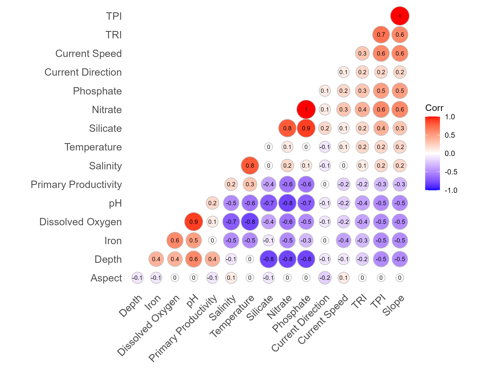
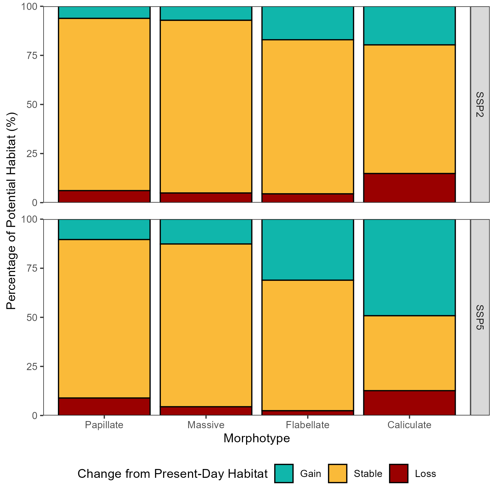
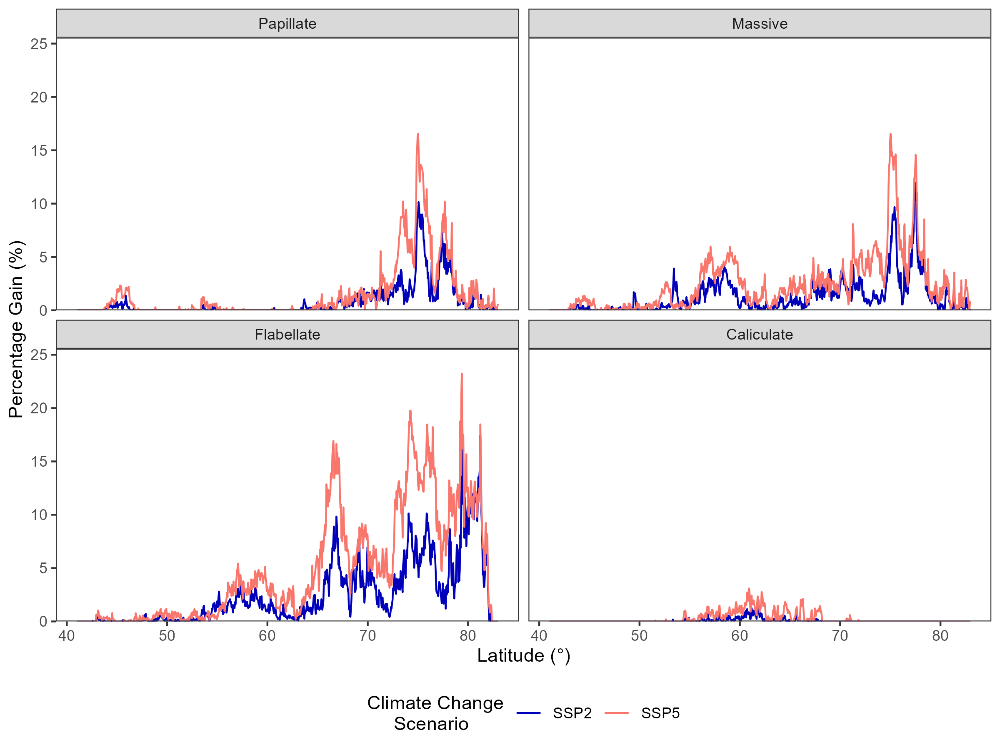

# Analysis

This section contains the scripts and figures produced to analyse and compare the model outputs from the [models](models) section.

### Correlation analysis
[correlation](correlation) contains the script used to analyse the correlation between variables downloaded from BIO-ORACLE

### Morphotype climate change response
[shifts](shifts) contains the script and excel spreadsheet to create the bar charts of morphotype response in future conditions

### Latitude and habitat gain
[latitude](latitude) contains the script and csvs of % habitat gain per latitude line to explore gains with increasing degree of latitude

