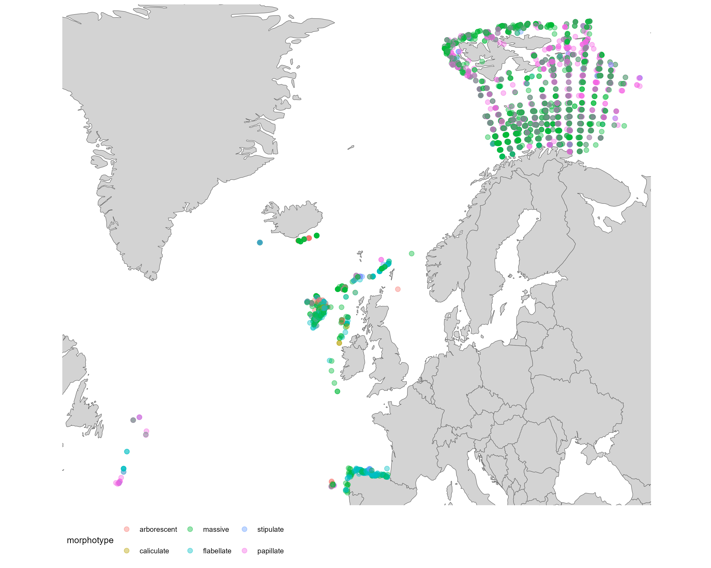

# Sponge Data

Data downloaded on 11/11/2024 and is a subset of the ICES VME database for public deep sea sponge records. All public data are under the Creative Commons (CC BY 4.0) licence.

Vulnerable Marine Ecosystems (VME). [11/11/2024]. ICES, Copenhagen, Denmark. https://vme.ices.dk

## How much data do I have?
I have 7731 records of sponges 

### Decades
The data spans from 1894-2023

| |decade|count
--|------|------
1 | 1890 |  1
2 | 1930 |  2
3 | 1970 | 10
4 | 1980 | 22
5 | 1990 | 15
6 | 2000 | 1359
7 | 2010 | 5071
8 | 2020 |1251

The majority of the data is collected between 2000 and 2023

### Distribution

### Morphotype
In the process of categorising morphotypes 

Of the 7731 observations, only 2313 are identified to phylum Porifera

## Distribution of Morphotypes
The distribution of morphotype records collected after 2000 looks like this:

## Still to do
- [ ] update [sponge guide](sponge_guide.pptx) with appropriate website/method of classification (website, picture etc)
- [ ] quantify how many records of each morhotype
- [ ] decide on extent

