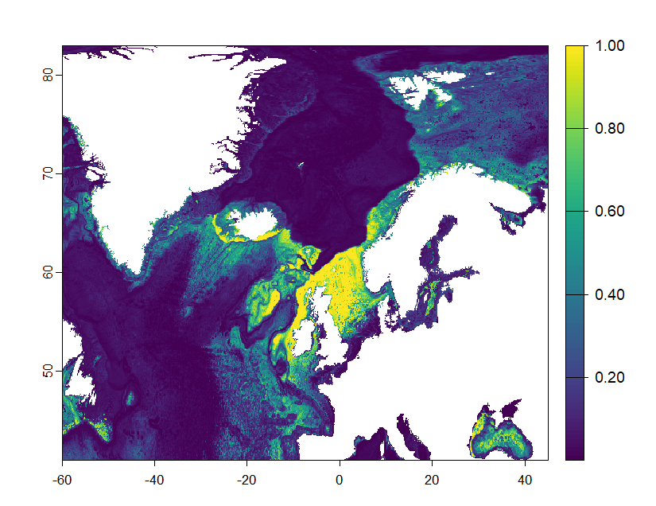

# Arborescent Distribution

[arborescent_ecoPA_model](arborescent_ecoPA_model.R) is the script used to model the present-day and future morphotype distributions of arborescent sponges

## Present Day distribution

I didn't predict future arborescent distributions since AUC = 0.61 < 0.8 which was the cut off for a reliable model
