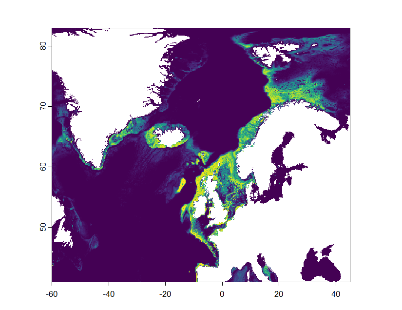
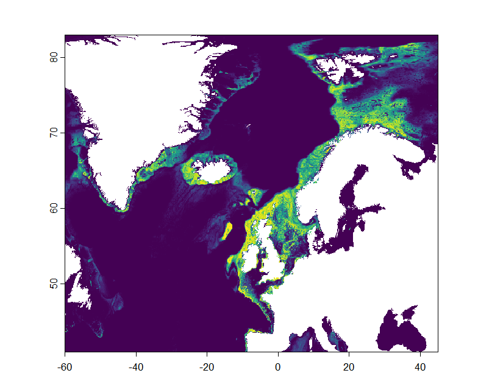
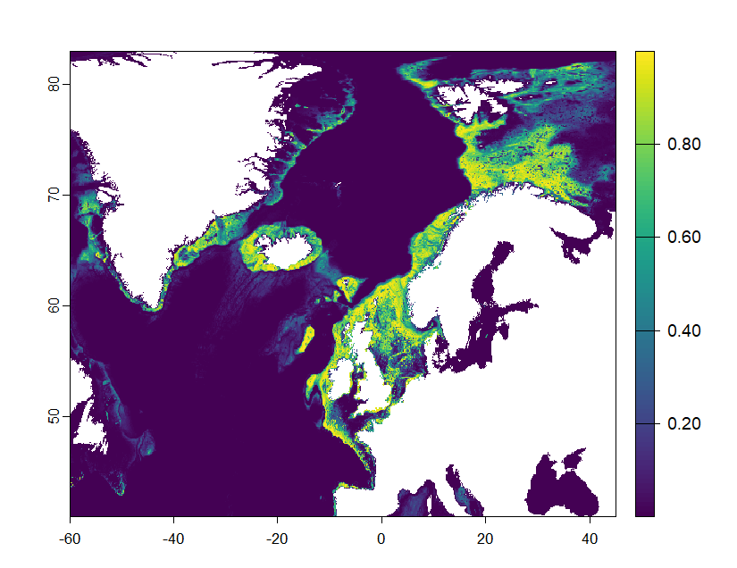
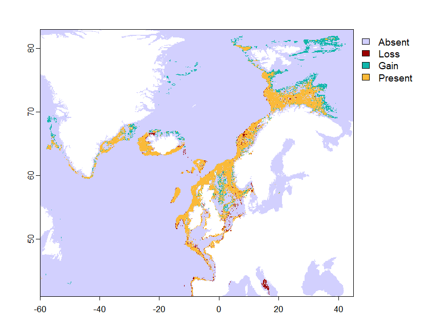
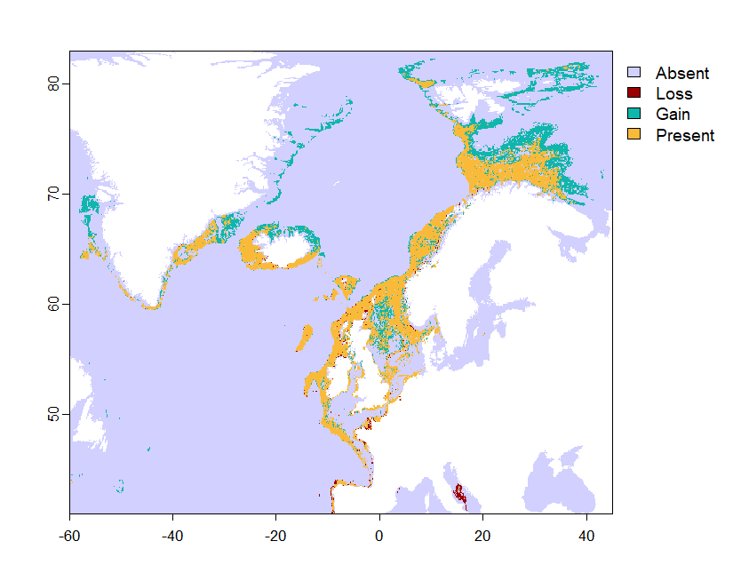

# Flabellate Distributions

[flabellate_ecoPA_model](flabellate_ecoPA_mx.R) is the script used to model the present-day and future morphotype distributions of flabellate sponges

## Present Day distribution

## 2050 Distributions
### SSP2

### SSP5

## Shift in suitable habitat
### SSP2

### SSP5

The percent changes were used in the [shift change analysis](analysis) section
