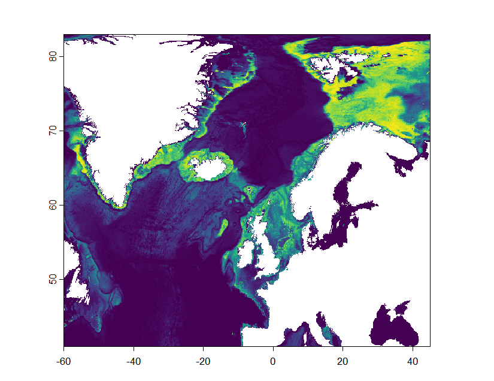
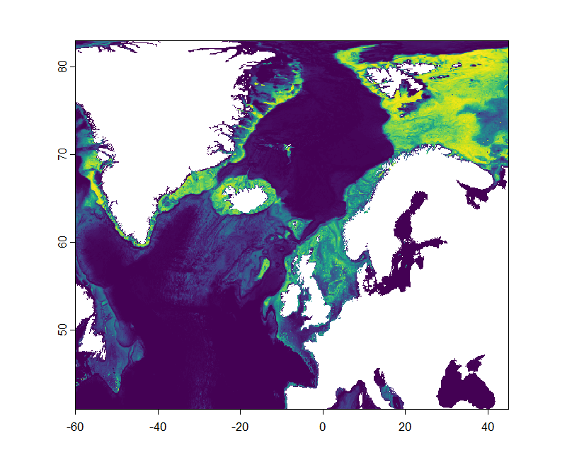
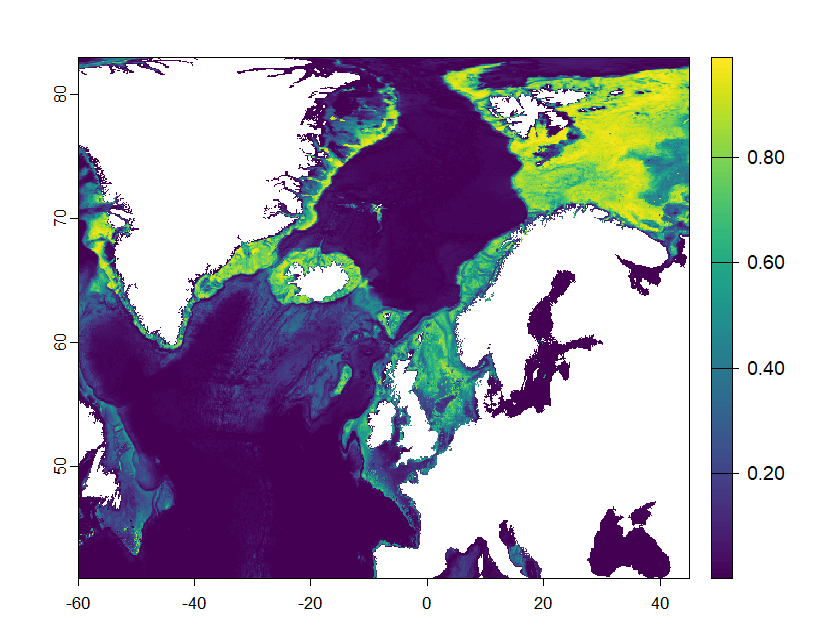
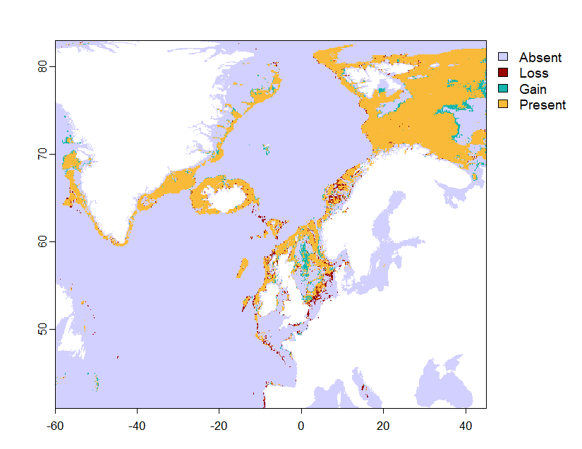
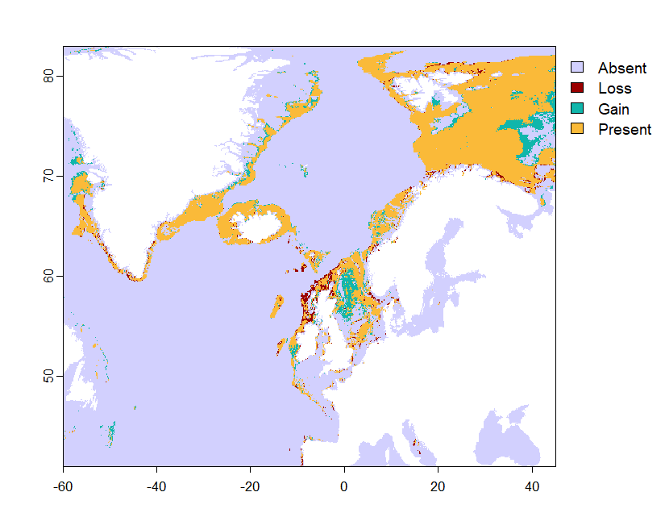
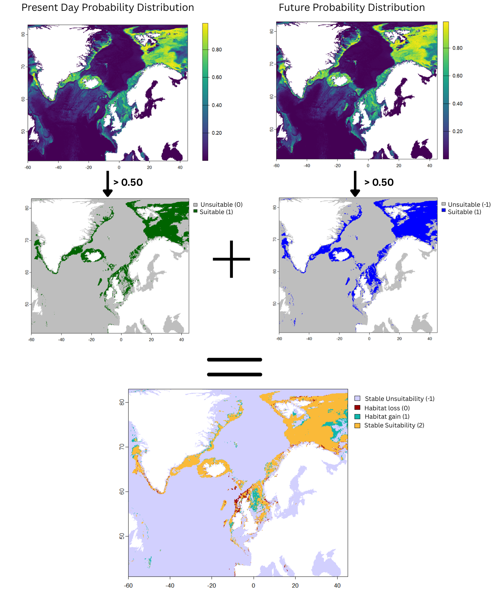

# Massive Distributions

[massive_ecoPA_models](massive_ecoPA_models.R) is the script used to model the present-day and future morphotype distributions of massive sponges

## Present Day distribution

## 2050 Distributions
### SSP2

### SSP5

## Shift in suitable habitat
### SSP2

### SSP5

The percent changes were used in the [shift change analysis](analysis) section

The [method_example](method_example) folder was used to generate graphs for figure 3 to explain the process of shift map formation.

