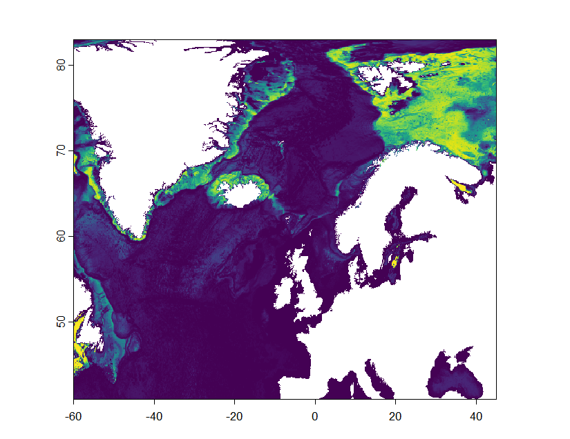
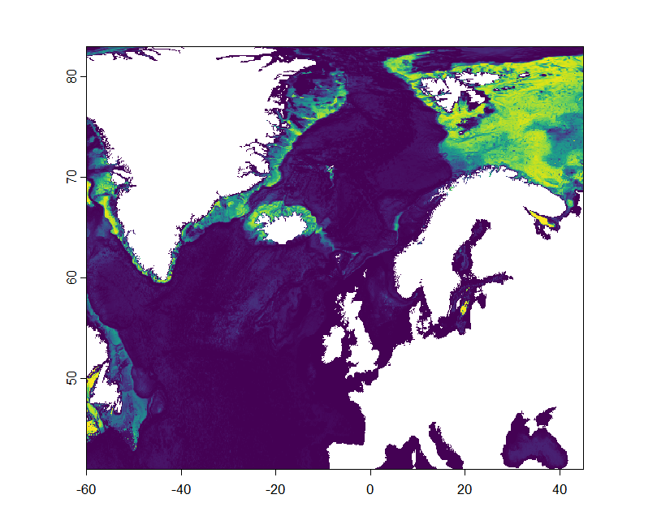
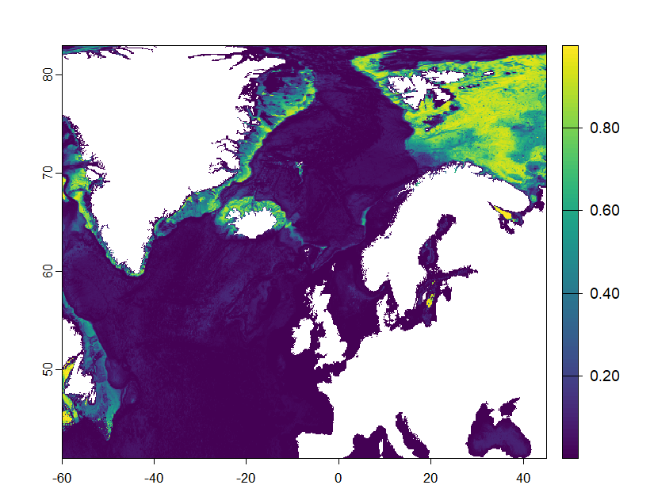
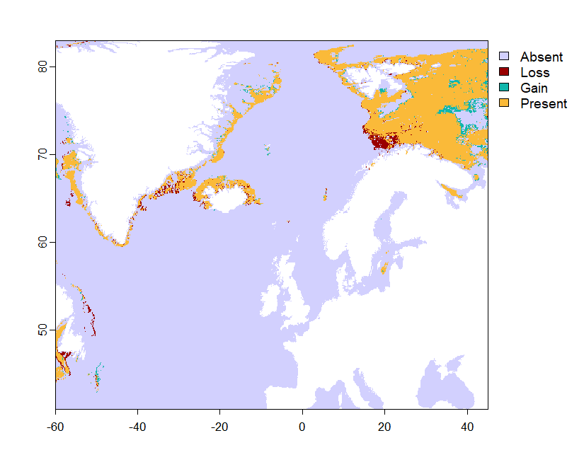

# Papillate Distributions

[papillate_ecoPA_models](papillate_ecoPA_models.R) is the script used to model the present-day and future morphotype distributions of papillate sponges

## Present Day distribution

## 2050 Distributions
### SSP2

### SSP5

## Shift in suitable habitat
### SSP2

### SSP5

The remaining files were used for shift and latitude change in the [analysis](analysis) section

