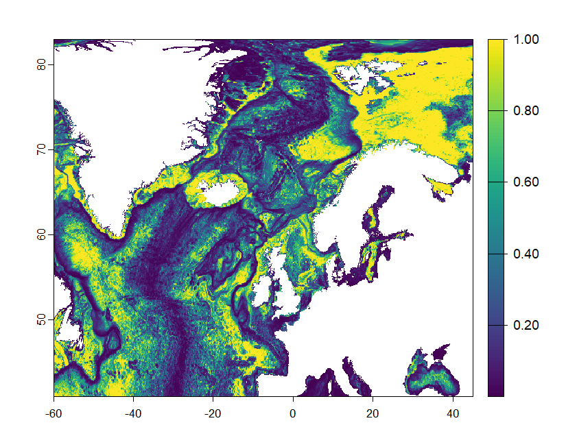

# Stipitate Distribution

[stipitate_ecoPA_model](stipitate_ecoPA_model.R) is the script used to model the present-day and future morphotype distributions of stipitate sponges

## Present Day distribution

I didn't predict future stipitate distributions since AUC = 0.53 < 0.8 which was the cut off for a reliable model
